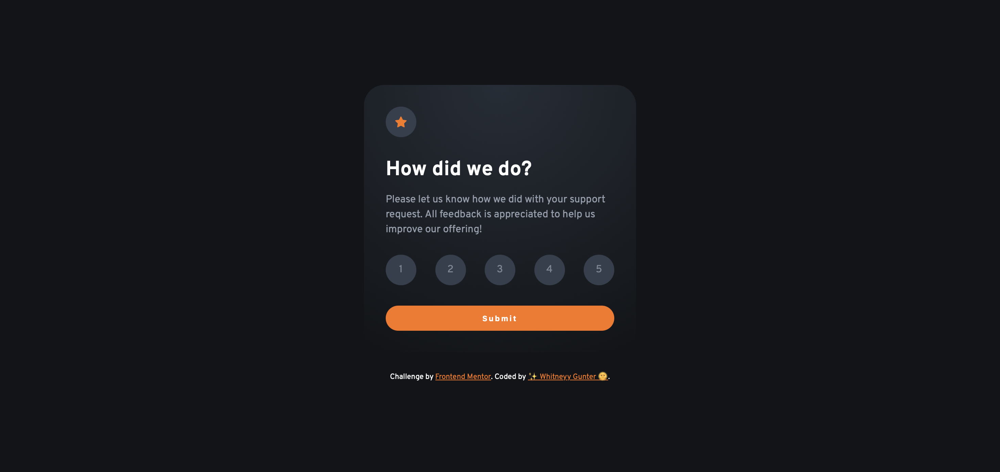
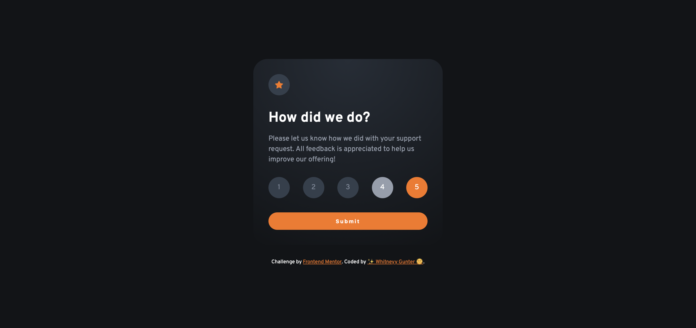
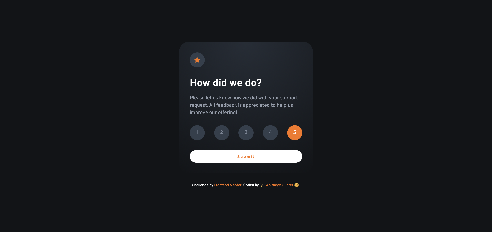
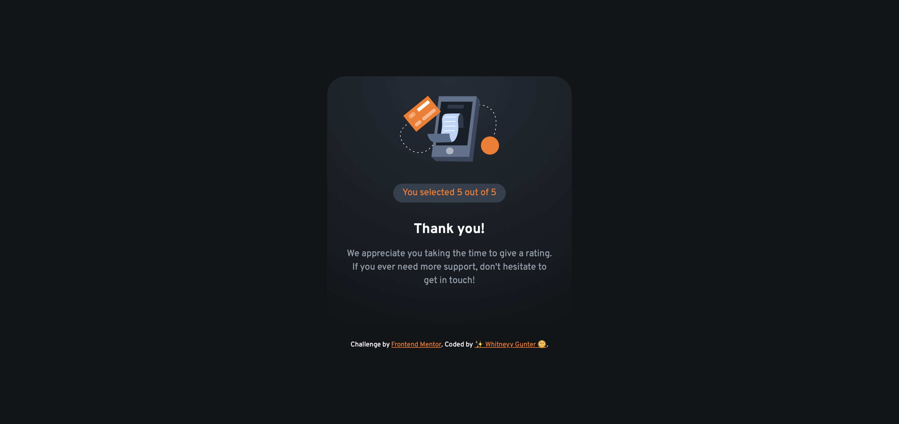

# Frontend Mentor - Interactive rating component solution

This is a solution to the [Interactive rating component challenge on Frontend Mentor](https://www.frontendmentor.io/challenges/interactive-rating-component-koxpeBUmI). Frontend Mentor challenges help you improve your coding skills by building realistic projects. 

## Table of contents

- [Overview](#overview)
  - [The challenge](#the-challenge)
  - [Screenshot](#screenshot)
  - [Links](#links)
- [My process](#my-process)
  - [Built with](#built-with)
  - [What I learned](#what-i-learned)
  - [Continued development](#continued-development)
- [Author](#author)

## Overview

### The challenge

Users should be able to:

- View the optimal layout for the app depending on their device's screen size
- See hover states for all interactive elements on the page
- Select and submit a number rating
- See the "Thank you" card state after submitting a rating

### Screenshot



**Rating Card Active & Thank You States**

- Selected Rating Active State



- Submit Button Active State



- Thank You Screen



### Links

- GitHub Solution Repo URL: [GitHub solution repo URL](https://github.com/whitgunt77/interactive-rating-card)
- Live Site URL: [Live site URL](https://whitgunt77.github.io/interactive-rating-card/)

## My process

### Built with

- Semantic HTML5 markup
- CSS custom properties (Variables)
- Flexbox for layout centering
- Mobile-first workflow
- Vanilla JavaScript for DOM manipulation

### What I learned

During this challenge, I focused on using accessible form elements (radio buttons) to handle user selection rather than just clickable `<div>` elements. This ensures keyboard users can interact with the rating system.

I'm particularly proud of this CSS pattern for styling the "active" state of a rating using the adjacent sibling combinator:

```css
/* Styling the label only when the hidden radio input is checked */
.rating-group input:checked + label {
  background-color: hsl(25, 97%, 53%);
  color: hsl(0, 100%, 100%);
}
```

### Continued development

In future projects, I want to:

- Implement web animations (CSS Keyframes or Web Animations API) to make the transition between "Rating" and "Thank You" states smoother.
- Explore using ARIA live regions to announce the "Thank You" state to screen reader users immediately upon submission.

## Author

- Frontend Mentor - [@whitgunt77](https://www.frontendmentor.io/profile/whitgunt77)
- GitHub - [@whitgunt77](https://github.com/whitgunt77)
